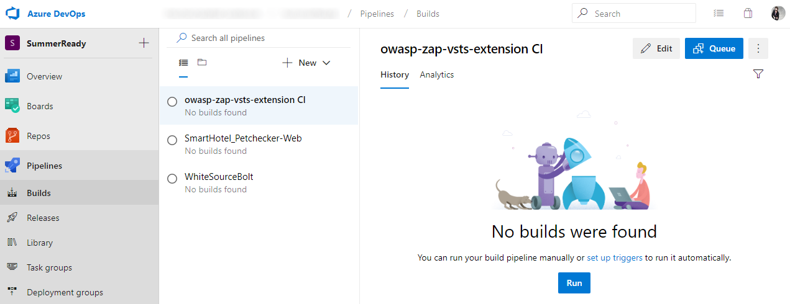

<a name="CICD"></a>
# Lab: Azure DevOps CI/CD

This lab will guide you through building Continuous Integration (CI) and Continuous Deployment (CD) pipelines with Azure DevOps. The build pipeline will make use of a Java application, built with Maven, but also a .NET Core and Azure Functions App.
For the release pipeline we'll be leveraging ARM templates and Azure App Services to host our application.

## Create Build Pipeline

* Navigate to *Pipelines*, *Builds*.

    

    ### WhiteSource Bolt Build
    1. Here you should see an existing build definition name *WhiteSourceBolt*.
    Under *New*, select *Import a pipeline* to import a precooked pipeline to build the recently imported SmartHotel repository:

        
        
    2. Drag and drop the `SmartHotel_Petchecker-Web.json` file, located on the Lab repository under *~/files/SmartHotel/*, or Browse for the same file. Then, press *Import* to start the import process:

        

        ```
        Change the Name, removing the "-import" portion of it.
        The final name should be "SmartHotel_Petchecker-Web", as shown in the image:
        ``` 

        
    
    3. Select the **Hosted VS2017** Agent pool:

        
  
    4. Now select the *Source Repository* `SmartHotel360-Website`, by pressing *Get sources*, *Azure Repos Git* and selecting the correct repository on the *Repository* dropdown:

        

    5. To finish, enable the *Continuous integration* trigger by navigating to *Triggers* and selecting *Enable continuous integration*:

        

        Save by pressing the **Save** button, confirming the save on the popup (no need to change anything on the *Select folder* or add a Comment):

        

    ### OWASP Build
    
    Now we'll be using an alternative way to setup our CI build, leveraging a YAML file.

    Navigate to the *owasp-zap-vsts-extension* repository, and drag and drop the **azure-pipelines.yml** file, located on the Lab contents you've downloaded, under *~/files/OWASP*, into the repository.

    

    Click on the **Commit** button to confirm.

    

    You should end up with the following contents:

    

    This will generate an additional build pipeline, now available together with the remaining ones.
    Navigate back to *Pipelines*, *Builds* to double check:

    


## Create Release Pipeline

* Under *Pipelines*, navigate to *Releases* and press **New pipeline**

    

    1. We first need to create a dummy, empty, Release pipeline in order for the *Import* to become available. 
    Let's do this by pressing *New pipeline*, *Empty job* and **Save**:

        

        

    2. Navigate back to *All pipelines* and select **Import release pipeline**:

        

    3. Drag and drop, or navigate as before, to select the **SmartHotel360_Website-Deploy.json** file:

        

    4. Press *OK* to start the import process. You should now have a release pipeline like this:

        

    5. Navigate to the Stage tasks:

        

    6. Select the *Agent job*, and set the *Agent pool* to **Hosted**

        

    7. Select the first task and, under *Azure Subscription*, select the **Manage** button.
    It will redirect you to a page were we'll be configuring access to the Resource Group from our Azure Subscription.

        

        Under `New service connection`, select `Azure Resource Manager`:

        

        Select the available *resource group* from the dropdown, give the service connection a name and press OK.

        > Important: Save the Resource Group name for later use (copy to notepad for example).

        

        You should then see a new Service connection appear:

        

 
    8. Going back to the *release pipeline* (should be on a previous tab on the browser), the dropdown should now show you the brand new *Service connection*.

        Select it.
        > If it hasn't loaded, press the refresh button on the right and then open the dropdown again.

        


        Step in each one of the tasks with error, selecting and authorizing an Azure Subscription to use in the lab. 

        > For the *ARM Outputs* task in particular, it's also required to specify the *Azure Connection Type* as **Azure Resource Manager**

    9. Navigate to *Variables* and update the values.

        **location:** West US

        **ResourceGroup:** <paste the resource group we've saved earlier: e.g. ResourceGroupXXXXX>

        

    10. Remove the existing *Artifact* by navigating back to the *Pipeline* tab, selecting the Artifact, and pressing *Delete*.

        

    11. Now, add the **SmartHotel_Petchecker-Web** build artifact. This will make sure we're using the artifact coming from the build we've created before.

        > Important: set the *Source alias* to `SmartHotel Petchecker Web`

        

    12. To finish, enable the Continuous Deployment trigger

        

    13. Press the **Save** button, confirming with the **OK** button.
    > Important: Set the release pipeline name to **SmartHotel360_Website-Deploy**


#### Run a test build

1. In Azure DevOps, click on Builds and, for each build, select it and press the "Queue" button on the right upper corner.

    

2. Monitor the build logs, by double clicking the running build, and wait for it to complete

   

3. The release will be triggered automatically when the build is complete (be patient, this can take some time). Review the results as it completes. 

   

4. Navigate to the release logs and check the details regarding the last step, **Echo Website Name**.

   

    Here you should see the website URL. Press <Ctrl> and click on the URL to navigate to it.

    

    The website we've just deployed looks like :

    


7. Now kick-off the full CI/CD pipeline by making an edit to the  code in the Azure DevOps code repository.
Navigate back to *Repos*, *SmartHotel360-Website* repository, select **appsettings.Development.json** and press *Edit*

    

8. Change the *Name* property value to something you want, and *Commit* the change after it

    


*********
