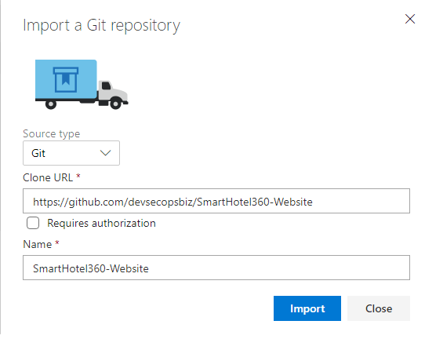

<a name="AzDevOps"></a>
# Lab: Create Azure DevOps Project 

This lab will guide you through the initial setup of an Azure DevOps Project, providing a quicker, prebuilt setup.

The first required step is to clone the public GitHub repository where the Lab is hosted.
This will allow you to have access to several pre-prepared assets, necessary for the different Lab modules we'll be implementing.

On the lab windows, press the *Windows* start menu and search for *x64_x86 Cross Tools Prompt for VS 2017*, launching it in *Administrator mode*.


Navigate to the root folder, by typing `cd\` and pressing *enter*. Then execute the following command:

```
git clone https://github.com/devsecopsbiz/technical-lab.git
```

And you will get all the content on the *C:\technical-lab* folder, as shown in the image:


## Setup Azure DevOps Project

>  Use Azure DevOps Labs to create a preconfigured project and enrich it for a quick start.

* Start by creating a new Project using a preselected Lab.
For that, on your browser navigate to the following URL:

    ```
    https://azuredevopsdemogenerator.azurewebsites.net/?name=WhiteSource-Bolt&templateid=77362
    ```

    1. Navigate to the Azure DevOps Demo Generator and *Sign In* with the credentials you've used to create the Azure DevOps Organization, and then press the **Accept** button to proceed.
    
        

    2. Select your Organization from the dropdown, fill in the *Project Name* with a name of your choice.
    
        Check the check-box allowing *WhiteSource Bolt* to be installed and then press *Create Project*:

        
    
    3. Wait for a few seconds for the project to create and then *Navigate* to it:

        

* Install additional extensions from the Marketplace:

    1. Navigate to `https://marketplace.visualstudio.com/items?itemName=keesschollaart.arm-outputs`, selecting the *Get it free* button.

        

    2. Now, select the recently created Azure DevOps Organization on the dropdown, and press *Install*.

        

    3. After a few seconds you should see a success message. Now, select the *Proceed to organization*.

         

    4. Navigate to `https://marketplace.visualstudio.com/items?itemName=keesschollaart.AzureCostInsights`, selecting the *Get it free* button.

        

    5. As for the previous extension, select the recently created Azure DevOps Organization on the dropdown, and press *Install*.

    6. After a few seconds you should see a success message. Select the *Proceed to organization*.

    7. Now, select the project you've just created, by pressing its name.


* Create a free account for *WhiteSource Bolt* 

    1. Navigate to *WhiteSource Bolt* under *Pipelines -> WhiteSource Bolt*.

    2. Fill in your details to create a free account.

        

    3. After a few seconds, we're good to go!

        

* Import additional Git repositories, required for the labs:

    1. Navigate to *Repos* and on the upper repositories drop down, select *Import repository*:

        

    2. Fill in the *Clone URL* with `https://github.com/devsecopsbiz/SmartHotel360-Website`
    and press *Import*:

        

        Wait for a couple of seconds for it to finish.

        

    3. Select *Import repository* again, now filling with     `https://github.com/devsecopsbiz/owasp-zap-vsts-extension`
    and press *Import*.

        

    4. You should now see the complete list of repositories available, has shown in the following image:

        


*********
