
# Lab: Connect Azure DevOps to Power BI

Now we're going to explore one of the many possibilities to reach out to key stakeholders like Business are.

We'll start by creating a custom Analytics view for approved bugs and then generate a Power BI report based on that view. You'll learn how to filter the Analytics view, create a trend chart, as well as a card showing the current count of approved bugs. 

Using Power BI connected to Analytics views, you can create reports on your work items. Reports can show your current work data and also historical revisions of the work items.  

## Create a view to only include Approved bugs

Under **Overview**, navigate to **Analytics view**, choose **New View** to create a custom view. Fill out the forms provided in each tab as shown in the steps below. 

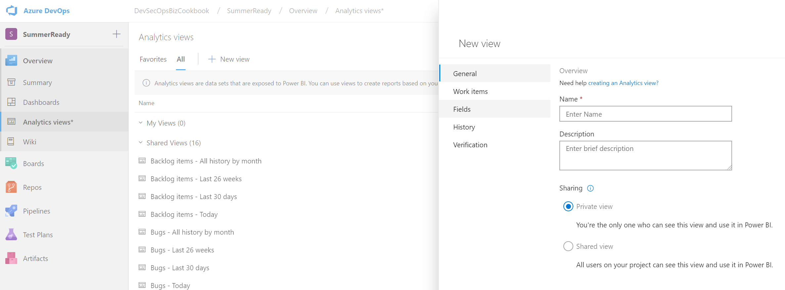

-------------

> If you don't see "Analytics views" available, navigate to your user details and select "Preview features". 
Then, activate the "Analytics views" preview flag.

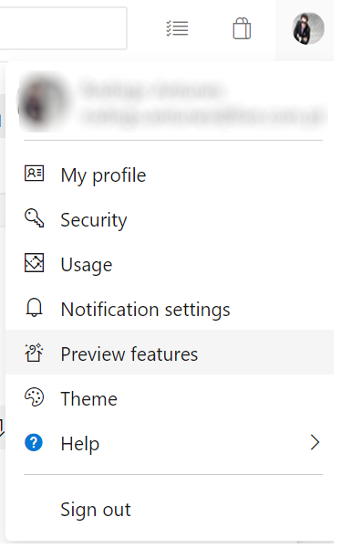

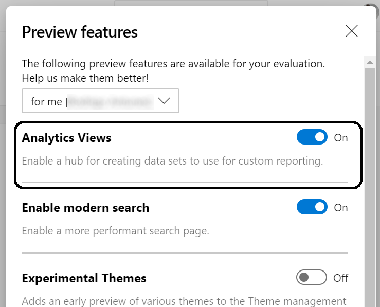

-------------

Choose **Continue** to move to the next tab in the panel. If you need to revisit a tab, simply click the tab title. 

### Name your view and set to Private  

1. Give your view a name, such as *Approved bugs*. Select **Private view** to save it under **My Views**. Otherwise, you can select **Shared view** to save it under **Shared Views**.  

    

Choose **Continue** to move to the next tab. 

2. From the **Work items** tab, select the Project and Team that contain the data you want to report on.  
 
    Here we choose the *MsReadyLab* project and the *MsReadyLab Team*.
    
    

	To add additional projects or teams, click *Add row icon* to add a new row and then select the project and team. 
    

3. Under **Backlogs and work items**, add a new row, and then select **Bug** from the list of work items types.

    

4. Under **Field criteria**, choose the **State** field set to **Approved**.

    
    
	Choose **Continue** to move to the next tab. 

5. In the next tab, **Fields**, keep the existing fields and include an additional field by pressing the "Add" button. Select the **Priority** field.  
    
    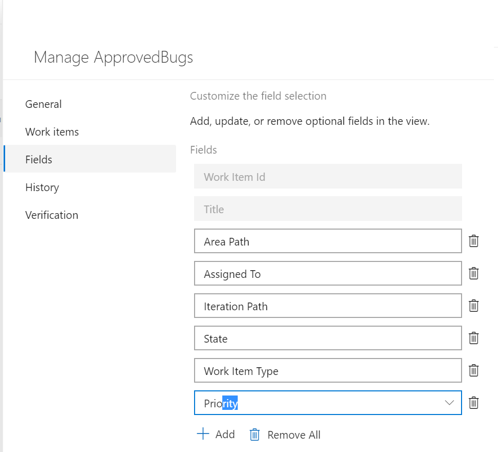

	Choose **Continue** to move to the next tab. 

6. In the **History** tab, select **Rolling period in days** and enter **60** days. Keep the **Granularity** set to **Daily**. These selections will generate 60 snapshot rows of data for each approved bug. Each day will include all the details of that work item as it was at the end of that day. 
    
    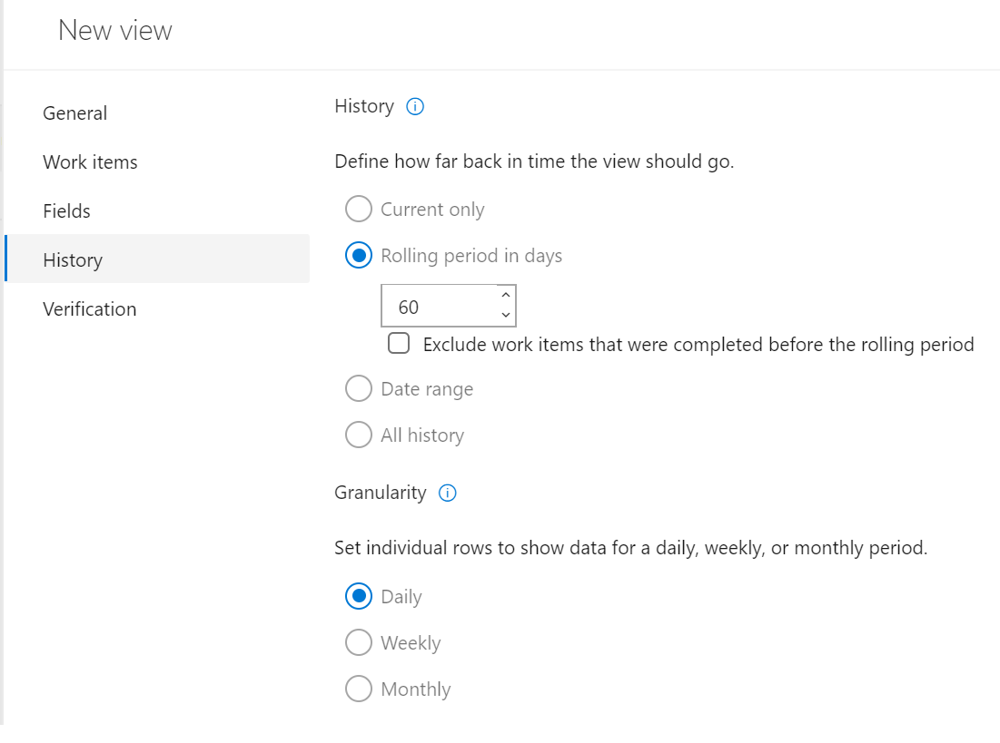

	Choose **Continue** to move to the next tab. 

7. On the last tab, **Verification**, click **Verify view**. The system will verify your view by running a test query against the data set it defines and validate all your filter criteria. 

    
  
	> Verification time will vary based on the amount of data defined in your view. Verify your view to make sure all the definitions are correct.  

	Once your view successfully verifies, choose **Save**. You can then start using it in Power BI. Verification also returns an estimate of the number of rows in the dataset and the time it will take to load in Power BI.

    
	
	If your view fails to verify successfully, you'll get an error explaining the issue and pointing to a possible fix. Try changing the options you selected in the **Work Items** and **History** tabs to include less data, and then verify the view again. 

## Open Power BI desktop and load your view 

Now we just need to connect our brand new Analytics view to Power BI, and we'll start doing that by opening Power BI Desktop.

1. Using the Windows search bar, search for **Power BI Desktop** and open it.

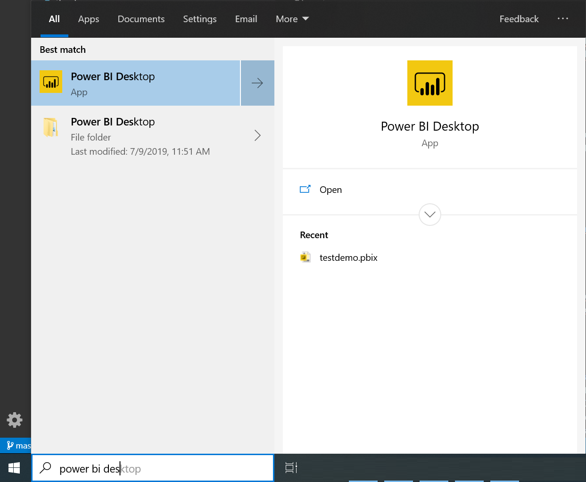

2. Now, choose **Get Data**, choose **More**, then **Azure DevOps (Beta)**, and then click **Connect**. 

    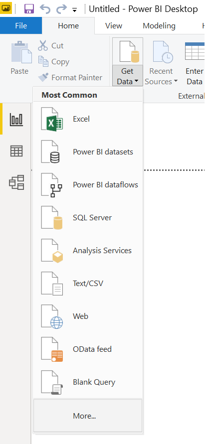
    
    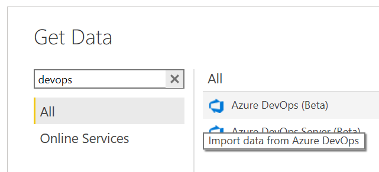    

3. Enter your organization name, the same Azure DevOps name you used to create the Approved Bugs view, and the same project for which you defined the Approved Bugs view. 

     

    Login with the lab credentials.

    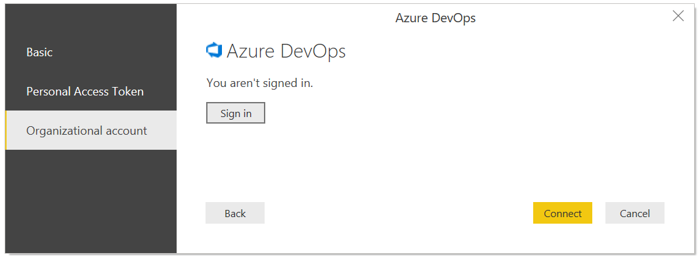 
    
    And confirm if you're signed in. You should see a message like:

    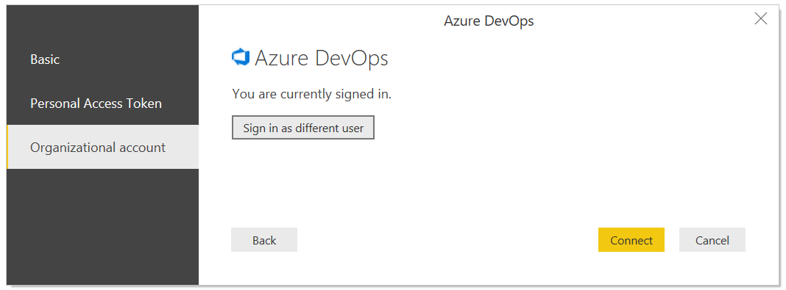 

4. Expand the **Private Views** folder, choose the **Approved Bugs** view you saved in the previous section, and then click **Load**. 

    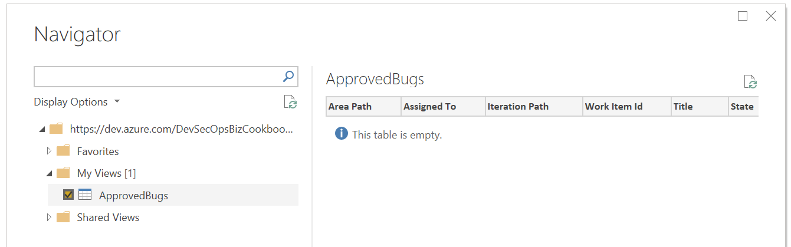

## Create a daily bug trend report 

After having imported data from our Azure DevOps Analytics view, we'll be briefly exploring how to create a Power BI report.

1. In your report, (1) select the Line chart visual, (2) enter `work item id` in the search field, and then (3) check the box for **Work Item Id**. 

    
  
2.	Click the context menu icon next to the **Work Item Id** field and change it from **Count** to **Count (Distinct)**.

    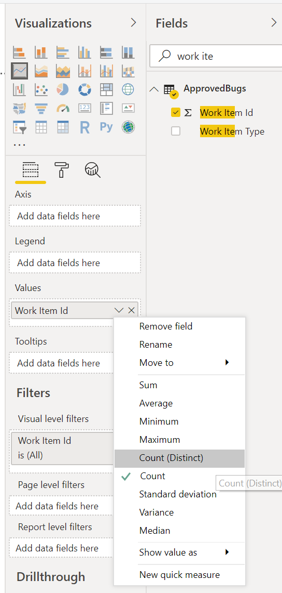

3. Next, select the **Date** field in the fields list as your axis. To see a daily trend, click the context menu icon next to the field and change it from **Date Hierarchy** to **Date**.

    

   To view trends over time, you want to use **Date** and not **Date Hierarchy**. The **Date Hierarchy** in Power BI rolls ups everything into a simple number for the period. The day level in the hierarchy rolls all days to a number between 1-31. For example, April 3 and May 3 both roll up into number 3. This is not the same as counting items per actual date.

## Filter your trend by Priority

1. To group your bugs by `Priority`, search for the field in the list (a). Drag the Priority field into the `Legend` of your trend chart (b)
    
    

2. The chart now shows a daily distinct count of bugs, grouped by Priority.

3. To just show only Priority 0 and 1 bugs, click the context menu icon next to the **Priority** field to set the filters.  

       
   
	The trend chart is now grouped and filtered by high priority bugs.

You should now have a configuration like:

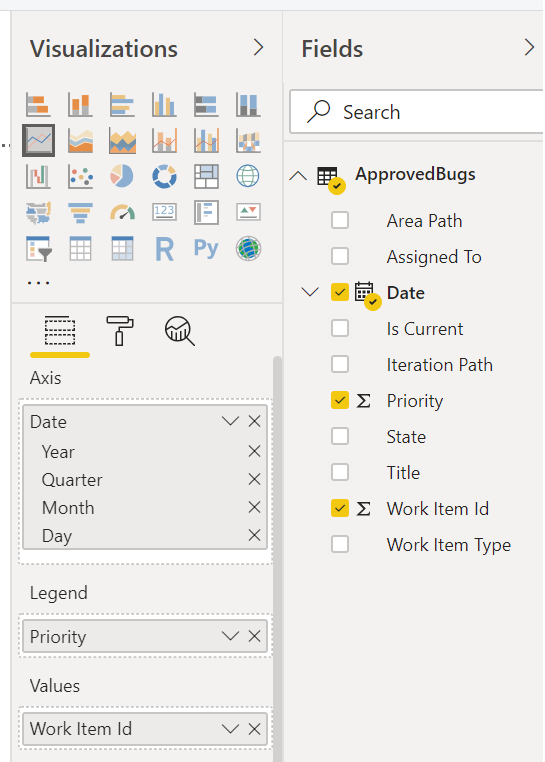   
   

## Create a card for latest bug count

1. Add a new page by clicking the plus sign (+) at the bottom of the page. 

2. Select the card visual, add the **Work Item Id** field, add the **Work Item Type** field, and click the context menu icon next to the field and change it from **Count** to **Count (Distinct)**.

	The card now shows the number of active bugs times the number of days they existed within the selected time period.  For this example, that number is 1066. 

       
    
3. To get the latest count, add **Is Current** as a page level filter, and select the True checkbox. The **Is Current** field is added automatically to all data sets, marking the rows that contain the latest revision of the work items.

       
   
	The value on this card should match the count on the last day of the trend chart, which you can obtain by returning to Page 1 and hovering over the last day as shown.  

    

## Save your report, optionally share with others 

1. Choose **File > Save As** to save your report to your local workspace. 

2. To publish your report to Power BI, choose the **Publish** tab.

    

    Select your Power BI workspace as the destination and press the Publish button.

    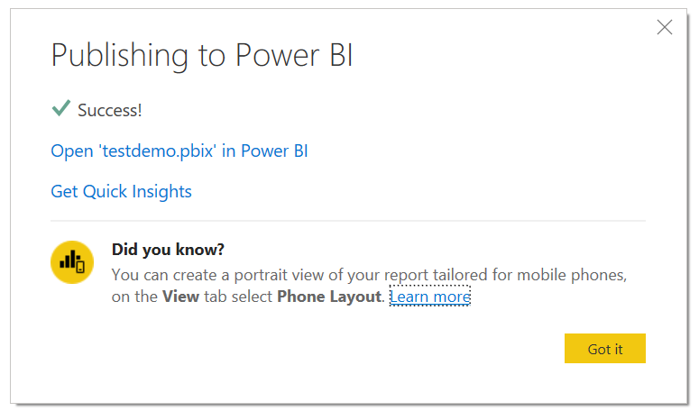

    After seeing the success message, navigate to your Workspace to check the report.

    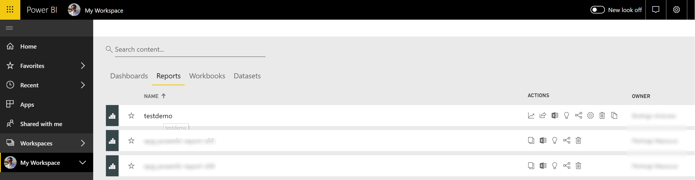

## Continue to explore your data

Analytics views provide you with a great deal of power and flexibility to filter your data and generate useful reports quickly and easily using Power BI. Within a custom view, you can create data sets that span multiple teams or projects. 

*************
