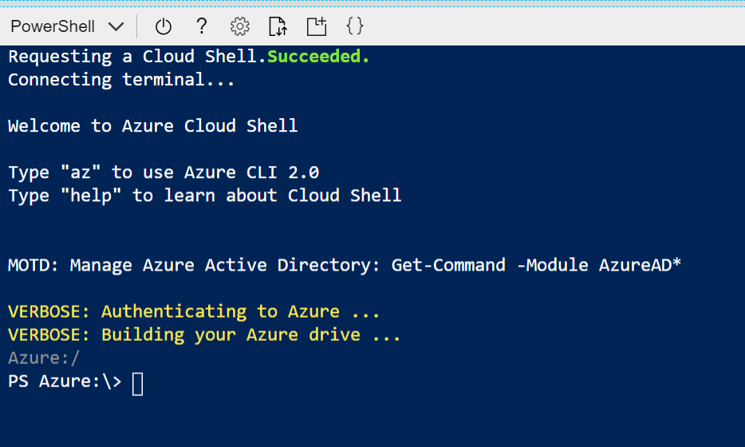
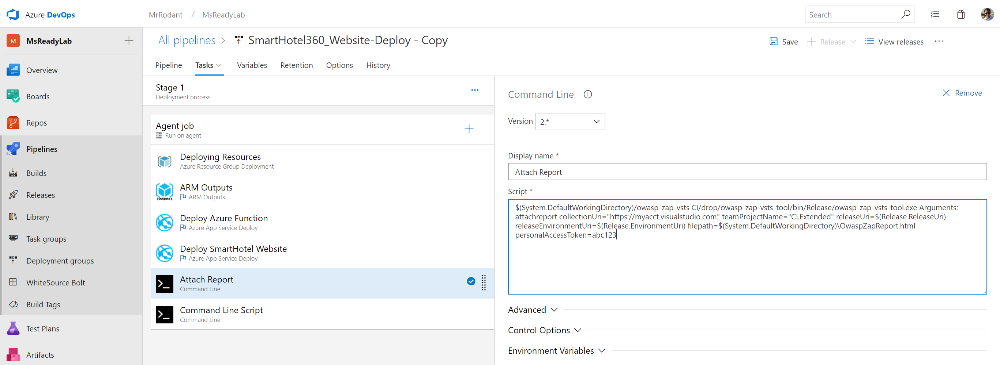
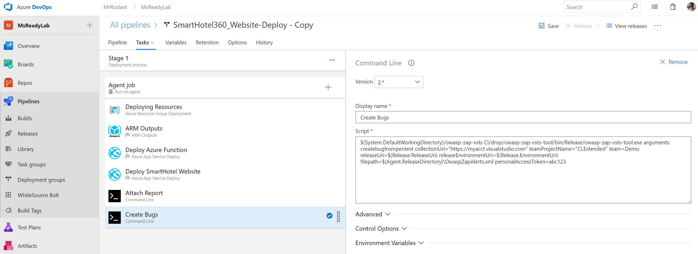

[](https://dev.azure.com/MSREADY19Sandbox/devsecopsbiz-session/_build/latest?definitionId=4&branchName=master)

# Microsoft Ready, Feb 2019
## AI-APP-ST300: Hands on Dev*Ops (Dev-Sec-Ops-Biz) 

**Welcome to Technical Lab for the AI-APP-ST300: Hands on Dev*Ops session!**

DevOps has been propagating throughout the world as the place to be in order to be Agile and successful. 
As maturity sets in, new challenges start to come up, namely the security role and the integration with the business teams. 
As such, buzz words like _DevSecOps_ and even _DevSecOpsBiz_ are becoming more popular in discussions. 

This lab session builds on top of _AI-APP-ST201: The new trends of Dev*Ops (DEV-SEC-OPS-BIZ)_, allowing you to experience first hand the construction of a real world scenario.

## Prerequisites 
Before we get started we need to ensure some prerequisites required for the lab.

* Azure Account [Azure Portal](https://portal.azure.com)
* Azure DevOps Services Organization [Azure DevOps](https://dev.azure.com/)

## Lab steps
* Start by [creating an Azure DevOps Project](#AzDevOps)
* Now let's [setup the build and release for the application](#CICD)
* Next, we'll want to [include Security into the pipeline](#Security)
* And to wrap up, let's [gather Business information](#Business)


> Optional: Connect Azure DevOps to Power BI
[Create an active bugs report in Power BI based on a custom Analytics view](https://docs.microsoft.com/en-us/azure/devops/report/powerbi/active-bugs-sample-report?view=vsts&tabs=new-nav)


*********

<a name="AzDevOps"></a>
# Lab: Create Azure DevOps Project 

This workshop will guide you through the initial setup of an Azure DevOps Project, providing a quicker, prebuilt setup ([option 1](#Option#1:-Azure-DevOps-Labs-++)), and a step by step setup ([option 2](#Option-#2:-Azure-DevOps-from-scratch)).

## Setup Azure DevOps Project

### Option #1: Azure DevOps Labs ++

>  Use Azure DevOps Labs to create a preconfigured project and enrich it for a quick start.

* Start by creating a new Project using a preselected [Lab](https://azuredevopsdemogenerator.azurewebsites.net/?name=WhiteSource-Bolt&templateid=77362)
    1. Navigate to the Azure DevOps Demo Generator and *Sign In* with the credentials you've used to create the Azure DevOps Organization:
    
        

    2. Select your Organization from the dropdown, fill in the Project Name, and *Create Project*:

        
    
    3. Wait for a few seconds for the project to create and then *Navigate* to it:

        

* Import additional Git repos, required for the labs:

    1. Navigate to *Repos* and on the upper repositories drop down, select *Import repository*:

        

    2. Fill in the *Clone URL* with `https://github.com/Microsoft/SmartHotel360-Website.git`
    and press *Import*:

        

    3. Select *Import repository* again, now filling with     `https://github.com/Deliveron/owasp-zap-vsts-extension.git`
    and press *Import*.


## Next step:  
[Setup the build and release for the application](#CICD)

*********

<a name="CICD"></a>
# Lab: Azure DevOps CI/CD

This lab will guide you through building Continuous Integration (CI) and Continuous Deployment (CD) pipelines with Azure DevOps. The build pipeline will make use of a Java application, built with Maven, but also a .NET Core and Azure Functions App.
For the release pipeline we'll be leveraging ARM templates and Azure App Services to host our application.

## Create Build Pipeline

* Wait a few seconds for the import process to finish and navigate to *Pipelines*, *Builds*:

    

    ### WhiteSource Bolt Build
    1. Under *New*, select *Import a pipeline* to import a precooked pipeline to build the recently imported repo:

        
        
    2. Drag and drop the `SmartHotel_Petchecker-Web.json` file, located on the Lab repository under *~/files/SmartHotel/*, or Browse for the same file. Then, press *Import* to start the import process:

        
    
    3. Select the `Hosted VS2017` Agent pool:

        
  
    4. Now select the Source Repo to the recently imported repository:

        

    5. To finish, enable the *Continuous integration* trigger, saving the build after it:

        

    ### OWASP Build
    
    Now we'll be using an alternative way to setup our CI build, leveraging a YAML file.

    6. Navigate to the `owasp-zap-vsts` repo, and drag and drop the `azure-pipelines.yml` file, located on the Lab contents you've downloaded, under *~/files/OWASP*


## Create Release Pipeline

* Under *Pipelines*, navigate to *Releases* and press `New pipeline`

    

    1. We first need to create a dummy, empty, Release pipeline in order for the *Import* to become available. 
    Let's do this by pressing `New pipeline`, `Empty job` and `Save`:

    

    2. Navigate back to `All pipelines` and `Import a release pipeline`:

    

    

    3. Drag and drop, or navigate, to select the `SmartHotel360_Website-Deploy.json` file:

    

    4. Press *OK* to start the import process. You should now have a release pipeline like this:

    

    5. Navigate to the Stage tasks:

    

    6. Select the first task and, under *Azure Subscription*, press `New`:

    

    7. This opens a pop up where we'll have to fill in the details of our *Azure Subscription*, where we'll be deploying out solution:

    > Step in each one of the tasks with error, selecting and authorizing an Azure Subscription to use in the lab. 

    8. To finish, enable the Continuous Deployment trigger

    


#### Run a test build

1. In Azure DevOps, click on Builds, select each build and click the "Queue" button on the right upper corner.

    

2. Monitor the builds and wait for the build to complete

   

3. The release will automatically start when the build is complete (be patient, this can take some time). Review the results as it is complete. 

   

4. Navigate to the deploy logs and check the details regarding the last step, `Deploy SmartHotel Website`.

   

5. Go to the end of the log, and grab the URL of the destination website.
It should look something like this: `https://smarthotel360lcu4bmxi7kl4w.scm.azurewebsites.net/api/deployments/21548112613183`

    Grab that value.

    

6. Using this, remove the `scm` and `api` details, ending up with a URL like: `https://smarthotel360lcu4bmxi7kl4w.azurewebsites.net/`

    Navigate to the new URL and you should be see the website we've just deployed.

    


7. Now kick-off the full CI/CD pipeline by making an edit to the  code in the Azure DevOps code repo.
Navigate back to *Repos*, *SmartHotel360-Website* repo, select `appsettings.Development.json` and press *Edit*

    

8. Change the *Name* property value to something you want, and *Commit* the change after it

    


## Next step:  
[Include Security into the pipeline](#Security)

*********

<a name="Security"></a>
# Lab: Security

This lab will guide you through adding some Security validations into our pipelines, detecting and fixing security vulnerabilities, but also problematic open source licenses.

## Review WhiteSource Bolt task configurations on Build

*WhiteSource Bolt for Azure DevOps* is a FREE extension, which scans all your projects and detects open source components, their license and known vulnerabilities.

It covers over 200 programming languages support and continuous tracking of multiple open source vulnerabilities databases like the NVD, security advisories, peer-reviewed vulnerability databases, and popular open source projects issue trackers.

### Let's start adding it to our pipelines

1. In Azure DevOps, click on "Pipelines" on the left menu and then click "Builds"

2. Select each build pipeline, click the "Edit" button, and select the `WhiteSource Bolt` task

    

3. Now navigate to *Pipelines*, *WhiteSource Bolt* on the left and explore the generated reports

    


## Add OWASP ZAP penetration testing tool to the Release pipeline

OWASP is a worldwide not-for-profit organization dedicated to helping improve the quality of software. ZAP is a free penetration testing tool for beginners to professionals. ZAP includes an API and a weekly docker container image that can be integrated into your deployment process

### Let's start adding it to our pipelines

1. Start by setting up a Docker host for later use:

    ## Deploy a template with the Azure Docker VM extension
    Let's use an existing quickstart template to create an Ubuntu VM that uses the Azure Docker VM extension to install and configure the Docker host. You can view the template here: [Simple deployment of an Ubuntu VM with Docker](https://github.com/Azure/azure-quickstart-templates/tree/master/docker-simple-on-ubuntu). 

    You need to login onto the [Azure Portal](https://portal.azure.com), and access the Cloud Shell, setting it up to *Bash*.

    

    After a few seconds you should see something like this:

    

    Cloud Shell already provides us the latest Azure CLI, allowing us to execute the following commands.

    First, create a resource group named *msReadyDevOps* in the *eastus* location:

    ```azurecli
    az group create --name msReadyDevOps --location eastus
    ```

    Next, deploy a VM with that includes the Azure Docker VM extension from [this Azure Resource Manager template on GitHub](https://github.com/Azure/azure-quickstart-templates/tree/master/docker-simple-on-ubuntu). When prompted, provide your own unique values for *newStorageAccountName*, *adminUsername*, *adminPassword*, and *dnsNameForPublicIP*:

    ```azurecli
    az group deployment create --resource-group msReadyDevOps \
        --template-uri https://raw.githubusercontent.com/Azure/azure-quickstart-templates/master/docker-simple-on-ubuntu/azuredeploy.json
    ```

    It takes a few minutes for the deployment to finish.


    ## Deploy your first NGINX container
    To view details of your VM, including the DNS name, use [az vm show](/cli/azure/vm):

    ```azurecli
    az vm show \
        --resource-group msReadyDevOps \
        --name myDockerVM \
        --show-details \
        --query [fqdns] \
        --output tsv
    ```

    SSH to your new Docker host. Provide your own username and DNS name from the preceding steps:

    ```bash
    ssh azureuser@mypublicdns.eastus.cloudapp.azure.com
    ```

    Once logged in to the Docker host, let's run an NGINX container:

    ```bash
    sudo docker run -d -p 80:80 nginx
    ```

    The output is similar to the following example as the NGINX image is downloaded and a container started:

    ```bash
    Unable to find image 'nginx:latest' locally
    latest: Pulling from library/nginx
    efd26ecc9548: Pull complete
    a3ed95caeb02: Pull complete
    a48df1751a97: Pull complete
    8ddc2d7beb91: Pull complete
    Digest: sha256:2ca2638e55319b7bc0c7d028209ea69b1368e95b01383e66dfe7e4f43780926d
    Status: Downloaded newer image for nginx:latest
    b6ed109fb743a762ff21a4606dd38d3e5d35aff43fa7f12e8d4ed1d920b0cd74
    ```

    Check the status of the containers running on your Docker host as follows:

    ```bash
    sudo docker ps
    ```

    The output is similar to the following example, showing that the NGINX container is running and TCP ports 80 and 443 and being forwarded:

    ```bash
    CONTAINER ID        IMAGE               COMMAND                  CREATED              STATUS              PORTS                         NAMES
    b6ed109fb743        nginx               "nginx -g 'daemon off"   About a minute ago   Up About a minute   0.0.0.0:80->80/tcp, 443/tcp   adoring_payne
    ```

    To see your container in action, open up a web browser and enter the DNS name of your Docker host:

    


2. Now let's grab a personal access token (PAT) we'll be needing later on.
    > Save that PAT token, it can't be retrieved later!

    2.1 Navigate to the user profile and select *Security*

    

    2.2 Select *Personal access token*

    

    2.3 Create a new personal access token

    

    2.4 Copy the token, making sure you don't lose it.
    

3. Now let's add some `Command` tasks to our release pipeline, one for attaching the generated analysis report and another to be able to create bugs if necessary:

    
    

4. Paste this command on the *Script* text box, changing the values in bold*, as seen in the image.
`$(System.DefaultWorkingDirectory)/owasp-zap-vsts CI/drop/owasp-zap-vsts-tool/bin/Release/owasp-zap-vsts-tool.exe Arguments: attachreport collectionUri="https://myacct.visualstudio.com" teamProjectName="MsReadyLab" releaseUri=$(Release.ReleaseUri) releaseEnvironmentUri=$(Release.EnvironmentUri) filepath=$(System.DefaultWorkingDirectory)\OwaspZapReport.html personalAccessToken=abc123`

    

5. Paste this for the *Create bugs* task.
`$(System.DefaultWorkingDirectory)/owasp-zap-vsts CI/drop/owasp-zap-vsts-tool/bin/Release/owasp-zap-vsts-tool.exe arguments: createbugfrompentest collectionUri="https://myacct.visualstudio.com" teamProjectName="CLExtended" team=Demo releaseUri=$(Release.ReleaseUri) releaseEnvironmentUri=$(Release.EnvironmentUri) filepath=$(Agent.ReleaseDirectory)\OwaspZapAlerts.xml personalAccessToken=abc123`

    


## Next step:  
[Gather Business information](#Business)

*********

<a name="Business"></a>
# Lab: Azure DevOps Business

This workshop will guide you through the process of creating and configuring a set of specialized dashboards, each with a diferent scope that can be used by distinct team members and stakeholders. 

## Create Build Pipeline

1. Create [Queries, Dashboards, charts, & widgets](https://docs.microsoft.com/en-us/azure/devops/report/dashboards/overview?view=vsts)