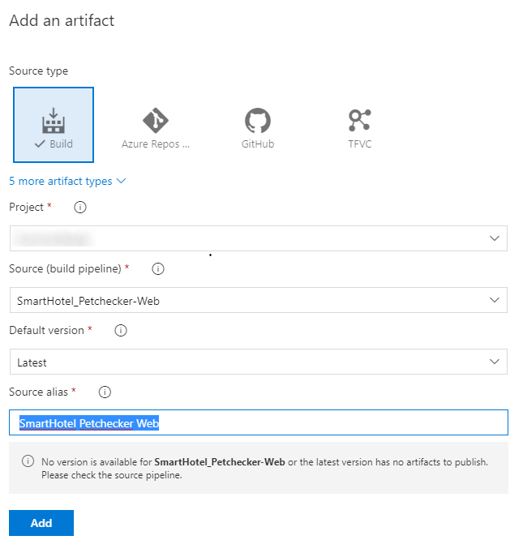

[](https://dev.azure.com/MSREADY19Sandbox/devsecopsbiz-session/_build/latest?definitionId=12&branchName=master)

# Microsoft Ready, Feb 2019
## AI-APP-ST300: Hands on Dev*Ops (Dev-Sec-Ops-Biz) 

**Welcome to Technical Lab for the AI-APP-ST300: Hands on Dev*Ops session!**

DevOps has been propagating throughout the world as the place to be in order to be Agile and successful. 
As maturity sets in, new challenges start to come up, namely the security role and the integration with the business teams. 
As such, buzz words like _DevSecOps_ and even _DevSecOpsBiz_ are becoming more popular in discussions. 

This lab session builds on top of _AI-APP-ST201: The new trends of Dev*Ops (DEV-SEC-OPS-BIZ)_, allowing you to experience first hand the construction of a real world scenario.

## Lab steps
* Start by setting up an [Azure DevOps Organization](#AzDevOpsOrg)
* Then, [create an Azure DevOps Project](#AzDevOps) for us to work in
* Now let's [setup the build and release for the application](#CICD)
* Next, we'll want to [include Security into the pipeline](#Security)
* And to wrap up, let's [gather Business information](#Business)


> Optional: Connect Azure DevOps to Power BI by [creating an approved bugs report in Power BI based on a custom Analytics view](#PBI)

*********

<a name="AzDevOpsOrg"></a>
# Lab: Create Azure DevOps Organization 

The first step is to create a brand new *Azure DevOps* Organization.
Start by opening your favorite browser and navigate to:

```
https://dev.azure.com
```

Press **Start free**.


And sign in with the supplied credentials for the lab.


And then press `Continue`.


You will end up with an empty Azure DevOps Organization. 
It's not necessary to create any *Project* at this time, you can proceed to next step.


*********

<a name="AzDevOps"></a>
# Lab: Create Azure DevOps Project 

This lab will guide you through the initial setup of an Azure DevOps Project, providing a quicker, prebuilt setup.

The first required step is to clone the public GitHub repository where the Lab is hosted.
This will allow you to have access to several pre-prepared assets, necessary for the different Lab modules we'll be implementing.

On the lab windows, press the *Windows* start menu and search for *x64_x86 Cross Tools Prompt for VS 2017*, launching it in *Administrator mode*.


Navigate to the root folder, by typing `cd\` and pressing *enter*. Then execute the following command:

```
git clone https://github.com/devsecopsbiz/technical-lab.git
```

And you will get all the content on the *C:\technical-lab* folder, as shown in the image:


## Setup Azure DevOps Project

>  Use Azure DevOps Labs to create a preconfigured project and enrich it for a quick start.

* Start by creating a new Project using a preselected Lab.
For that, on your browser navigate to the following URL:

    ```
    https://azuredevopsdemogenerator.azurewebsites.net/?name=WhiteSource-Bolt&templateid=77362
    ```

    1. Navigate to the Azure DevOps Demo Generator and *Sign In* with the credentials you've used to create the Azure DevOps Organization, and then press the **Accept** button to proceed.
    
        

    2. Select your Organization from the dropdown, fill in the *Project Name* with a name of your choice.
    
        Check the check-box allowing *WhiteSource Bolt* to be installed and then press *Create Project*:

        
    
    3. Wait for a few seconds for the project to create and then *Navigate* to it:

        

* Install additional extensions from the Marketplace:

    1. Navigate to `https://marketplace.visualstudio.com/items?itemName=keesschollaart.arm-outputs`, selecting the *Get it free* button.

        

    2. Now, select the recently created Azure DevOps Organization on the dropdown, and press *Install*.

        

    3. After a few seconds you should see a success message. Now, select the *Proceed to organization*.

         

    4. Navigate to `https://marketplace.visualstudio.com/items?itemName=keesschollaart.AzureCostInsights`, selecting the *Get it free* button.

        

    5. As for the previous extension, select the recently created Azure DevOps Organization on the dropdown, and press *Install*.

    6. After a few seconds you should see a success message. Now, select the *Proceed to organization*.

    7. Now, select the project you've just created, by pressing the name.


* Create a free account for *WhiteSource Bolt* 

    1. Navigate to *WhiteSource Bolt* under *Pipelines -> WhiteSource Bolt*.

    2. Fill in your details to create a free account.

        

    3. After a few seconds, we're good to go!

        

* Import additional Git repositories, required for the labs:

    1. Navigate to *Repos* and on the upper repositories drop down, select *Import repository*:

        

    2. Fill in the *Clone URL* with `https://github.com/devsecopsbiz/SmartHotel360-Website`
    and press *Import*:

        

    3. Select *Import repository* again, now filling with     `https://github.com/Deliveron/owasp-zap-vsts-extension.git`
    and press *Import*.


## Next step:  
[Setup the build and release for the application](#CICD)

*********

<a name="CICD"></a>
# Lab: Azure DevOps CI/CD

This lab will guide you through building Continuous Integration (CI) and Continuous Deployment (CD) pipelines with Azure DevOps. The build pipeline will make use of a Java application, built with Maven, but also a .NET Core and Azure Functions App.
For the release pipeline we'll be leveraging ARM templates and Azure App Services to host our application.

## Create Build Pipeline

* Wait a few seconds for the import process to finish and navigate to *Pipelines*, *Builds*:

    

    ### WhiteSource Bolt Build
    1. Under *New*, select *Import a pipeline* to import a precooked pipeline to build the recently imported repository:

        
        
    2. Drag and drop the `SmartHotel_Petchecker-Web.json` file, located on the Lab repository under *~/files/SmartHotel/*, or Browse for the same file. Then, press *Import* to start the import process:

        

        Change the *Name*, removing the *-import* part.
        The final name should be **SmartHotel_Petchecker-Web**, as shown in the image:

        
    
    3. Select the **Hosted VS2017** Agent pool:

        
  
    4. Now select the *Source Repository* to the recently imported repository:

        

    5. To finish, enable the *Continuous integration* trigger:

        

        Save by pressing the **Save** button, confirming the save on the popup:

        

    ### OWASP Build
    
    Now we'll be using an alternative way to setup our CI build, leveraging a YAML file.

    Navigate to the *owasp-zap-vsts-extension* repository, and drag and drop the **azure-pipelines.yml** file, located on the Lab contents you've downloaded, under *~/files/OWASP*, into the repository.
    Click on the **Commit** button to confirm.

    You should end up with the following contents:

    

    This will generate the following build pipeline:

    


## Create Release Pipeline

* Under *Pipelines*, navigate to *Releases* and press **New pipeline**

    

    1. We first need to create a dummy, empty, Release pipeline in order for the *Import* to become available. 
    Let's do this by pressing *New pipeline*, *Empty job* and **Save**:

        

        

    2. Navigate back to *All pipelines* and select **Import release pipeline**:

        

    3. Drag and drop, or navigate as before, to select the **SmartHotel360_Website-Deploy.json** file:

        

    4. Press *OK* to start the import process. You should now have a release pipeline like this:

        

    5. Navigate to the Stage tasks:

        

    6. Select the *Agent job*, and set the *Agent pool* to **Hosted**

        

    7. Select the first task and, under *Azure Subscription*, select the **Manage** button.
    It will redirect you to a page were we'll be configuring access to the Resource Group from our Azure Subscription.

        

        Under `New service connection`, select `Azure Resource Manager`:

        

        Select the available *resource group* from the dropdown, give the service connection a name and press OK.

        > Important: Save the Resource Group name for later use (copy to notepad for example).

        

        You should then see a new Service connection appear:

        

 
    8. Going back to the *release pipeline* (should be on a previous tab on the browser), the dropdown should now show you the brand new *Service connection*.

        Select it.
        > If it hasn't loaded, press the refresh button on the right and then open the dropdown again.

        


        Step in each one of the tasks with error, selecting and authorizing an Azure Subscription to use in the lab. 

        > For the *ARM Outputs* task in particular, it's also required to specify the *Azure Connection Type* as **Azure Resource Manager**

    9. Navigate to *Variables* and update the values.

        **location:** West US

        **ResourceGroup:** <paste the resource group we've saved earlier>

        

    10. Remove the existing *Artifact*.

        

    11. Now, add the **SmartHotel_Petchecker-Web** build artifact. This will make sure we're using the artifact coming from the build we've created before.

        > Important: set the *Source alias* to `SmartHotel Petchecker Web`

        

    12. To finish, enable the Continuous Deployment trigger

        

    13. Press the **Save** button, confirming with the **OK** button.


#### Run a test build

1. In Azure DevOps, click on Builds, navigate to **Folders** and, for each build, select it and press the "Queue" button on the right upper corner.

    

2. Monitor the build logs, by double clicking the running build, and wait for it to complete

   

3. The release will be triggered automatically when the build is complete (be patient, this can take some time). Review the results as it is complete. 

   

4. Navigate to the release logs and check the details regarding the last step, **Echo Website Name**.

   

    Here you should see the website URL. Press <Ctrl> and click on the URL to navigate to it.

    

    The website we've just deployed looks like :

    


7. Now kick-off the full CI/CD pipeline by making an edit to the  code in the Azure DevOps code repository.
Navigate back to *Repos*, *SmartHotel360-Website* repository, select **appsettings.Development.json** and press *Edit*

    

8. Change the *Name* property value to something you want, and *Commit* the change after it

    


## Next step:  
[Include Security into the pipeline](#Security)

*********

<a name="Security"></a>
# Lab: Security

This lab will guide you through adding some Security validations into our pipelines, detecting and fixing security vulnerabilities, but also problematic open source licenses.

## Review WhiteSource Bolt task configurations on Build

*WhiteSource Bolt for Azure DevOps* is a FREE extension, which scans all your projects and detects open source components, their license and known vulnerabilities.

It covers over 200 programming languages support and continuous tracking of multiple open source vulnerabilities databases like the NVD, security advisories, peer-reviewed vulnerability databases, and popular open source projects issue trackers.

### Let's start adding it to our pipelines

1. In Azure DevOps, click on "Pipelines" on the left menu and then click "Builds"

2. Select each build pipeline, click the "Edit" button, and select the **WhiteSource Bolt** task

    

3. Now navigate to *Pipelines*, *WhiteSource Bolt* on the left and explore the generated reports

    


## Add OWASP ZAP penetration testing tool to the Release pipeline

OWASP is a worldwide not-for-profit organization dedicated to helping improve the quality of software. ZAP is a free penetration testing tool for beginners to professionals. ZAP includes an API and a weekly docker container image that can be integrated into your deployment process

### Let's start adding it to our pipelines

1. Start by setting up a Docker host for later use:

    ## Deploy a template with the Azure Docker VM extension
    Let's use an existing quickstart template to create an Ubuntu VM that uses the Azure Docker VM extension to install and configure the Docker host.

    You need to login onto the Azure Portal (`https://portal.azure.com`), and access the Cloud Shell, setting it up to *Bash*.

    

    Since we're using brand new Subscriptions, we need to create a storage to support Cloud Shell.

    Press **Show advanced settings** and fill in **Storage account** and **File share** before hitting the **Create storage** button.
    
    

    

    After a few seconds you should see something like this:

    

    Cloud Shell already provides us the latest Azure CLI, allowing us to execute the following commands.

    First, grab the resource group name (*name* property) already created for the lab. Paste it on notepad for example.

    ```azurecli
    az group list
    ```

    

    Next, deploy a VM with that includes the Azure Docker VM extension from [this Azure Resource Manager template on GitHub](https://github.com/Azure/azure-quickstart-templates/tree/master/docker-simple-on-ubuntu). When prompted, provide your own unique values for *adminUsername*, *adminPassword*, and *dnsNameForPublicIP*:

    > Replace the name of the resource group with the one you got previously

    ```azurecli
    az group deployment create --resource-group <REPLACE HERE> --template-uri https://raw.githubusercontent.com/Azure/azure-quickstart-templates/master/docker-simple-on-ubuntu/azuredeploy.json
    ```

    It takes a few minutes for the deployment to finish.


    ## Deploy your first NGINX container
    To view details of your VM, including the DNS name, use *az vm show*:

    > Replace the name of the resource group with the one you got previously

    ```azurecli
    az vm show --resource-group <REPLACE HERE> --name myDockerVM --show-details --query [fqdns] --output tsv
    ```

    SSH to your new Docker host. Provide your own username and DNS name from the preceding steps:

    ```
    ssh azureuser@mypublicdns.eastus.cloudapp.azure.com
    ```

    Once logged in to the Docker host, let's run an NGINX container:

    ```
    sudo docker run -d -p 80:80 nginx
    ```

    The output is similar to the following example as the NGINX image is downloaded and a container started:

    ```
    Unable to find image 'nginx:latest' locally
    latest: Pulling from library/nginx
    efd26ecc9548: Pull complete
    a3ed95caeb02: Pull complete
    a48df1751a97: Pull complete
    8ddc2d7beb91: Pull complete
    Digest: sha256:2ca2638e55319b7bc0c7d028209ea69b1368e95b01383e66dfe7e4f43780926d
    Status: Downloaded newer image for nginx:latest
    b6ed109fb743a762ff21a4606dd38d3e5d35aff43fa7f12e8d4ed1d920b0cd74
    ```

    Check the status of the containers running on your Docker host as follows:

    ```
    sudo docker ps
    ```

    The output is similar to the following example, showing that the NGINX container is running and TCP ports 80 and 443 and being forwarded:

    ```
    CONTAINER ID        IMAGE               COMMAND                  CREATED              STATUS              PORTS                         NAMES
    b6ed109fb743        nginx               "nginx -g 'daemon off"   About a minute ago   Up About a minute   0.0.0.0:80->80/tcp, 443/tcp   adoring_payne
    ```

    To see your container in action, open up a web browser and enter the DNS name of your Docker host:

    


2. Before proceeding any further, let's run a OWASP ZED Attack Proxy against our published website.

    > Note: Replace the website URI with the one you've deployed earlier  

    ```
    docker run -v $(pwd):/zap/wrk/:rw -t owasp/zap2docker-weekly zap-baseline.py \
        -t https://smarthotel360lcu4bmxi7kl4w.azurewebsites.net -g gen.conf -r testreport.html
    ```
    Docker image will be pulled and the container will be then executed.

    

    When if finishes you should see a summary like this

    

    
3. Navigate back to your Azure DevOps Project and let's grab a personal access token (PAT) we'll be needing later on.
    > Save that PAT token, it can't be retrieved later

    3.1 Navigate to the user profile and select *Security*

    

    3.2 Select *Personal access token*

    

    3.3 Create a new personal access token

    

    3.4 Copy the token, making sure you don't lose it.

    

4. On your Azure DevOps project, navigate to *Pipelines*, *Releases* *SmartHotel360_Website-Deploy*, and press the **Edit** button.

    Then, under *Variables*, add a new variable setting:

    **Name:** PAT

    **Value:** <copied PAT token>

    **Secret:** press the locker button, making it a secret, hiding the contents

    You should get the following configuration:

    

    Save the release pipeline.


4. Let's get back to the Release pipeline and add some extra tasks to launch the ZAP test and grab the results.
Start by adding two **SSH** tasks, one for running the tests and another for publishing the test report to a public website. 

    Under `Pipeline`, `Stages`, view stage tasks:

    

    Add a new Artifact, from the *owasp-zap-vsts-extension* build, as shown in the following image:

    

    4.1. For the first `SSH` task, we need to specify the command to run and check the `Continue on error` option. This is required due to possible failing tests, that we don't want to prevent the deployment to proceed.

    

    > Tip: Rename `Display name` to make it clearer to understand what is going on here.

    Change the URI with the value of your own website, published on the previous Labs, and copy the updated command:

    ```
    docker run -v $(pwd):/zap/wrk/:rw -t owasp/zap2docker-weekly zap-baseline.py -t $(SmartHotelWebsiteURL) -g gen.conf -r $(Release.DefinitionName)_$(Release.ReleaseName)_OwaspZapReport.html
    ```

    4.2. Before going further we need to configure the SSH service connection to the provisioned Docker machine.
    Press the *Manage* button, *New service connection*, *SSH*, and fill in the following details, replacing *Host name*, *User name* and *Password* with your own details, specified on the previous steps of this lab.

    

    Press *OK* and go back to the previous tab, on the release pipeline. Refresh the *SSH service connection* drop down and select the fresh new connection. 

    4.3. On the second `SSH` task insert the following command:

    ```
    docker stop $(docker ps -a -q)
    docker run -v $(pwd):/usr/share/nginx/html -d -p 80:80 nginx
    ```

    This will copy the generated test report to the NGINX container, making it publicly available.
    Rename the *Display name* as suggested before, making it clearer to understand in the future.

    4.4. Next we'll be adding a *Powershell* task to download the generated test report and pass into the release pipeline.

    Add the following command to download the file, changing the *URI* on both commands.

    ```
    Invoke-WebRequest -Uri "http://<msreadydockervm>.<eastus>.cloudapp.azure.com/$(Release.DefinitionName)_$(Release.ReleaseName)_OwaspZapReport.html" -OutFile "$(System.DefaultWorkingDirectory)\OwaspZapReport.html"
    ```

    
   
   4.5. To finish, add a *Command Line* task, were we'll be executing the **owasp-zap-vsts-tool.exe** to attach the report into Azure DevOps.

    

5. Paste this command on the *Script* text box as seen in the image, adapting the URI on the Echo command. 

    ```
    $(System.DefaultWorkingDirectory)/_owasp-zap-vsts-extension/drop/owasp-zap-vsts-tool/bin/Release/owasp-zap-vsts-tool.exe attachreport collectionUri="$(System.TeamFoundationCollectionUri)" teamProjectName="$(System.TeamProject)" releaseUri=$(Release.ReleaseUri) releaseEnvironmentUri=$(Release.EnvironmentUri) filepath=$(System.DefaultWorkingDirectory)\OwaspZapReport.html personalAccessToken=$(PAT)

    echo "http://<msreadydockervm>.<eastus>.cloudapp.azure.com/$(Release.DefinitionName)_$(Release.ReleaseName)_OwaspZapReport.html"
    ```

    

6. To finish the Security Lab, run the release pipeline and, when it has finished, navigate to your website made available using NGINX.
You can check the URI by navigating to the *Attach Report* task log:

    

    You should see something like:

     


## Next step:  
[Gather Business information](#Business)

*********

<a name="Business"></a>
# Lab: Azure DevOps Business

This workshop will guide you through the process of creating and configuring a set of specialized dashboards, each with a different scope that can be used by distinct team members and stakeholders. 

## Azure Cost Insights

It's easy to get your Azure Costs out of control. _Wouldn't it be great to get insights of your infrastructure spending in your daily routine?_

Costs are a concern of everyone, developers, product owners and operations.
They come together in Azure DevOps, so why not show these insights there?

*Azure Cost Insights* is a widget that you can add on your Azure DevOps Dashboard.

This widget is built with the belief that cost insights need to be scoped to your costs. 


### Getting started

You need to create an Azure Pipeline for the widget to work. This pipeline is going to download and host your cost-data, used by the widget.


 
1. **Create the build pipeline**<br/>

    Navigate to *Pipelines*, *Builds* and *Import a pipeline*.

    

    Drag and drop the **Cost Insights.json** file, located on the Lab repository under *~/files/Business/*, or Browse for the same file. Then, press *Import* to start the import process:

    

    After importing, configure the missing settings as following:

    

    **Pipeline** -> **Agent pool**: Hosted VS2017

    **Get sources** -> **Repository**: SmartHotel360-Website
    
    **Download cost data** -> **Azure RM Subscription**: `Azure subscription being used in the lab`

    When you're finished, your  pipeline will look like this:

    

2. **Queue the build** and wait for it to finish<br/>

    

3. **Add the Widget to your Dashboard**<br/>
    - Go to your teams' dashboard and add a 'Azure Cost Insights' widget.

        Navigate back to *Overview*, *Dashboards* and press the **Add a widget** button.

        

        Then, search for the **Azure Cost Insights** widget and press the **Add** button.

        

        Configure it by selecting the build we've just created, grouping by *Resource Type* as shown in the image:

         

        Now add another 'Azure Cost Insights' and configure it as shown below:

        
     
## Examples


*********

<a name="PBI"></a>
# (Optional) Lab: Connect Azure DevOps to Power BI

In this lab, we'll show you how to create a custom Analytics view for active bugs and then generate a Power BI report based on that view. You'll learn how to filter the Analytics view, create a trend chart, as well as a card showing the current count of approved bugs. 

 Using Power BI connected to Analytics views, you can create reports on your work items. Reports can show your current work data and also historical revisions of the work items.  

Follow these steps to create a report in Power BI desktop that shows a **daily active trend of  bugs** based on a custom **Analytics view**:

1. From the web portal for Azure DevOps:   
	a. Open **Analytics views**  
	b. Create a custom Analytics view for your data.   
2. From the Power BI Desktop:  
	a. Get the data set defined by the Analytics view   
	b. Create a trend report  
	c. Apply filters to your trend report  
	d. Create a card and apply the Is Current=True filter to show current count.  

<a id="prerequisites">  </a>
## Prerequisites  

In order to create a Power BI report that references an Analytics view, you must meet the following criteria:  

- Have installed *Power BI Desktop* *February 2018 Update* or later version. You can download this client application from the official [Power BI Desktop download page](https://powerbi.microsoft.com/desktop).
- Have tracked bugs for some period of time on which to generate a trend report. 


## Create a view to only include Approved bugs


From the web portal, **Analytics view**, choose **New View** to create a custom view. Fill out the forms provided in each tab as shown in the steps below. 

Choose **Continue** to move to the next tab in the panel. If you need to revisit a tab, simply click the tab title. 

### 1. Name your view and set to Private  

1. Give your view a name, such as *Approved bugs*. Select **Private view** to save it under **My Views**. Otherwise, you can select **Shared view** to save it under **Shared Views**.  

    

Choose **Continue** to move to the next tab. 

2. From the **Work items** tab, select the Project and Team that contain the data you want to report on.  
 
    Here we choose the *MsReadyLab* project and the *MsReadyLab Team*.
    
    

	To add additional projects or teams, click *Add row icon* to add a new row and then select the project and team. 
    

3. Under **Backlogs and work items**, add a new row, and then select **Bug** from the list of work items types.

    

4. Under **Field criteria**, choose the **State** field set to **Active**.

    
    
	Choose **Continue** to move to the next tab. 

5. In the next tab, **Fields**, we'll keep the most common fields selection. This selection will also include any custom fields that have been added to your project.  
    
    

	Choose **Continue** to move to the next tab. 

6. In the **History** tab, select **Rolling period in days** and enter **60** days. Keep the **Granularity** set to **Daily**. These selections will generate 60 snapshot rows of data for each approved bug. Each day will include all the details of that work item as it was at the end of that day. 
    
    

	Choose **Continue** to move to the next tab. 

7. On the last tab, **Verification**, click **Verify view**. The system will verify your view by running a test query against the data set it defines and validate all your filter criteria. 

    
  
	> Verification time will vary based on the amount of data defined in your view. Verify your view to make sure all the definitions are correct.  

	Once your view successfully verifies, choose **Save**. You can then start using it in Power BI. Verification also returns an estimate of the number of rows in the dataset and the time it will take to load in Power BI.

    
	
	If your view fails to verify successfully, you'll get an error explaining the issue and pointing to a possible fix. Try changing the options you selected in the **Work Items** and **History** tabs to include less data, and then verify the view again. 

## Open Power BI desktop and load your view 

1. Open Power BI Desktop.  
 
2. Choose (1) **Get Data**, choose (2) **Online Services**, then (3) **Azure DevOps (Beta)**, and then click (4) **Connect**. 

    
    
3. Enter your organization name, the same Azure DevOps name you used to create the Active Bugs view, and the same project for which you defined the Active Bugs view. 

     

4. Expand the **Private Views** folder, choose the **Approved Bugs** view you saved in the previous section, and then click **Load**. 

    

## Create a daily bug trend report 

1. In your report, (1) select the Line chart visual, (2) enter `work item id` in the search field, and then (3) check the box for **Work Item Id**. 

    

	This will change your chart to a single dot.  
  
2.	Click the context menu icon next to the **Work Item Id** field and change it from **Count** to **Count (Distinct)**.

    

3. Next, (1) select the **Date** field in the fields list as your axis. To see a daily trend, (2) click the context menu icon next to the field and change it from **Date Hierarchy** to **Date**.

    

   To view trends over time, you want to use **Date** and not **Date Hierarchy**. The **Date Hierarchy** in Power BI rolls ups everything into a simple number for the period. The day level in the hierarchy rolls all days to a number between 1-31. For example, April 3 and May 3 both roll up into number 3. This is not the same as counting items per actual date.

## Filter your trend by Priority

1. To group your bugs by `Priority`, search for the field in the list (a). Drag the Priority field into the `Legend` of your trend chart (b)
    
    

2. The chart now shows a daily distinct count of bugs, grouped by Priority.

3. To just show only Priority 0 and 1 bugs, click the context menu icon next to the **Priority** field to set the filters.  

       
   
	The trend chart is now grouped and filtered by high priority bugs.

## Create a card for latest bug count

1. Add a new page by clicking the plus sign (+) at the bottom of the page. 

2. Select the card visual, add the **Work Item Id** field, add the **Work Item Type** field, and click the context menu icon next to the field and change it from **Count** to **Count (Distinct)**.

	The card now shows the number of active bugs times the number of days they existed within the selected time period.  For this example, that number is 1066. 

       
    
3. To get the latest count, add **Is Current** as a page level filter, and select the True checkbox. The **Is Current** field is added automatically to all data sets, marking the rows that contain the latest revision of the work items.

       
   
	The value on this card should match the count on the last day of the trend chart, which you can obtain by returning to Page 1 and hovering over the last day as shown.  

    

## Save your report, optionally share with others 

1. Choose **File > Save As** to save your report to your local workspace. 

2. To publish your report to Power BI, choose the **Publish** tab.

    

## Continue to explore your data

Analytics views provide you with a great deal of power and flexibility to filter your data and generate useful reports quickly and easily using Power BI. Within a custom view, you can create data sets that span multiple teams or projects. 

*************
