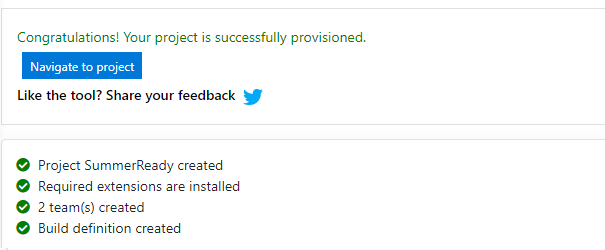

# Microsoft Ready, Feb 2019
## AI-APP-ST300: Hands on Dev*Ops (Dev-Sec-Ops-Biz) 

# Lab: Create Azure DevOps Project 

This workshop will guide you through the initial setup of an Azure DevOps Project, providing a quicker, prebuilt setup ([option 1](#Option#1:-Azure-DevOps-Labs-++)), and a step by step setup ([option 2](#Option-#2:-Azure-DevOps-from-scratch)).

## Setup Azure DevOps Project

### Option #1: Azure DevOps Labs ++

>  Use Azure DevOps Labs to create a preconfigured project and enrich it for a quick start.

* Start by creating a new Project using a preselected [Lab](https://azuredevopsdemogenerator.azurewebsites.net/?name=WhiteSource-Bolt&templateid=77362)
    1. Navigate to the Azure DevOps Demo Generator and *Sign In* with the credentials you've used to create the Azure DevOps Organization:
    
        

    2. Select your Organization from the dropdown, fill in the Project Name, and *Create Project*:

        

    3. Wait for a few seconds for the project to create and then *Navigate* to it:

        

* Import additional Git repos, required for the labs:

    1. Navigate to *Repos* and on the upper repositories drop down, select *Import repository*:

        

    2. Fill in the *Clone URL* with    `https://github.com/Microsoft/SmartHotel360-Website.git`
    and press *Import*:

        

    3. Select *Import repository* again, now filling with     `https://github.com/Deliveron/owasp-zap-vsts-extension.git`
    and press *Import*:

        

## Next step:  
[Setup the build and release for the application](README-2-CICD.md)